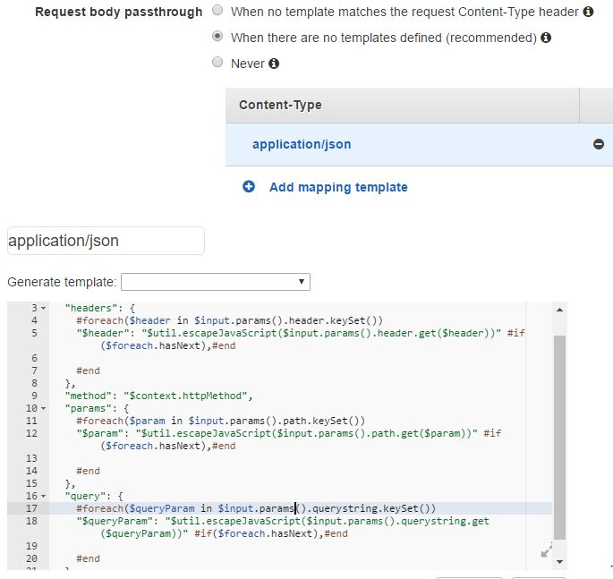

I had a small project in which I needed to send the data from a sensor to AWS IoT and then store it on a database. As I had enough knowledge over DynamoDB, I decided to store it on Dynamo and then I visualized the data using elasticSearch and Kibana. In fact that wasn’t bad idea but after sometime I found out that Kibana is very basic and it doesn’t fulfill all of the requirements.
So I decided to implement my web app but before that I had to have the data already exposed with some API to consume it in my web app. Therefore I decided to use other services of Amazon to accomplish this task 🙂
As I already said, I had my data on a table of DynamoDB and of course I needed API Gateway for exposing it (either HTTP or HTTPS) but then I couldn’t find any solution to execute a query from API Gateway on the DynamoDB. Therefore I used Lambda functions to do that for me and it was successful and in fact it has a good performance on response.
My DynamoDB data architecture is simple as this:

```json
{
“device_id”: “d_1”,
“payload”: {
“button_1”: true,
“button_2”: true,
“button_3”: true,
“button_4”: true
},
“timestamp”: 1487240559
}
```

In that I have “device_id” as primary key and “timestamp” as a sort key.

For designing my Rest API I had to know which combination of data I needed so I could implement my Lambda and API gateway calls based on that.
In my web app I needed to have a last state of all buttons on specific device and also a specific button. In addition I wanted to have a historic data for each button too.

- For getting last record on all buttons of a device: `$API_BASE_URL/{device_id}`
- For getting last state of a specific button: `$API_BASE_URL/{device_id}/{button_id}`
- For getting last states of a specific button between two timestamp (historic data – xxx would be timestamp in millisecond of 10 digits): `$API_BASE_URL/{device_id}/{button_id}?from_ts=xxx&to_ts=xxx`

We start with API gateway… let’s create new API and name it whatever you want. Then create a resource and name it “device” and in the resource path write “{device}” so later when you put the name of device id in the URL it can understand it as a parameter. afterwards, create a method under device resource and choose “GET”. it will create a method and you see the four boxes related to the implementation of method. ok now we created an empty API for our first path
let’s create another resource for our second and third path. We can have together in one API since the path is the same and just URL parameters are different.
Create a resource and name it “button” and in the path write “{button}”. after that create a method and again choose “GET”. (Of course we can use a Post for historic part and send our parameter in the body of POST but for sake of simplicity we do it with GET)

Now, before doing the configuration of out APIs let’s go to Lambda service and create our functions. So in the Lambda service create two functions, one for our “device” API and one for our “button” and name whatever you want (I named them api_device and api_button). In the step by step creation part, choose blank function and no trigger, then name the function and choose “Nodejs” for run-time (I write normally in Nodejs but if you want of course you can write in other available run-time languages too). Also, take into account that you need to choose a role which has a permission to run the lambda function plus reading the dynamoDB. The other configuration are OK by default (I always increase the timeout too so if it takes time I don’t get any error)

Let’s get back to our API Gateway… now we configure both of the APIs in the way that they call the specific Lambda function and send the URL parameters as the function parameters to Lambda so we can run the query based on the parameter and respond back to API Gateway the result of the query.

So for the both API do this: on the GET method, choose “Integration Request” and then inside that, choose “Lambda function” as integration type then you should choose the dedicated lambda function which we have created for that API and hit apply. The important part is for both of them we need a configuration to send the URL parameters and query to Lambda function, therefore on the bottom of the page there is a section called “body mapping”, inside that we add “application/json” and under that it gives us a blank text body. so copy and paste below code there.

```json
{
  "body" : $input.json('$'),
  "headers": {
    #foreach($header in $input.params().header.keySet())
    "$header": "$util.escapeJavaScript($input.params().header.get($header))"
    #if($foreach.hasNext),#end

    #end
  },
  "method": "$context.httpMethod",
  "params": {
    #foreach($param in $input.params().path.keySet())
    "$param": "$util.escapeJavaScript($input.params().path.get($param))"
    #if($foreach.hasNext),#end

    #end
  },
  "query": {
    #foreach($queryParam in $input.params().querystring.keySet())
    "$queryParam": "$util.escapeJavaScript($input.params().querystring.get($queryParam))"
    #if($foreach.hasNext),#end

    #end
  }
}
```

What we do in this code is, we pass whatever our call has including header (headers), parameters (params) and url queries (query) to the lambda function as a parameter.




Great! we have our API ready to deploy but before that let’s write our Lambda functions too…

Open the first Lambda function and write your code to query the DynamoDB and return the result including last state of the buttons related to the device that has been passed through parameter of the function. Mine came out like below:

```js
var doc = require('dynamodb-doc')
var dynamo = new doc.DynamoDB()

// Main function
exports.handler = (event, context, callback) => {
  // get device name from event
  var device = event.params.device

  //params for query last record of a device
  var params = {
    TableName: 'YOUR DYNAMODB TABLE NAME',
    KeyConditionExpression: 'device_id = :device ',
    ExpressionAttributeValues: { ':device': device },
    ScanIndexForward: false,
    Limit: 1,
  }
  // Run the query
  dynamo.query(params, function(err, data) {
    if (err) {
      console.error('Unable to query. Error:', JSON.stringify(err, null, 2))
    } else {
      console.log('Query succeeded.')
      // respond to API
      callback(null, data.Items[0])
    }
  })
}
```

As you can see I could receive the device name in url as event of the function in the “event.params.device” path and then I run the query in which I choose all record that “device_id” is “{device}” and I limit it to one record so by default it returns the last one since it is Descending.
This one actually was simpler than second one. In second one I need to respond in two different ways.

1.  return just the last state of the button if there is no “from_ts” or “to_ts”
2.  In case of having “from_ts” and “to_ts” in the query params, return all records between “from_ts” and “to_ts”

So my code look like this:

```js
var doc = require('dynamodb-doc')
var dynamo = new doc.DynamoDB()

// Main Function
exports.handler = (event, context, callback) => {
  // default values for from and to
  var from = 0
  var to = 0
  // Getting url query for From and To
  if (event.query.from_ts !== undefined) {
    from = parseInt(event.query.from_ts)
  }
  if (event.query.to_ts !== undefined) {
    to = parseInt(event.query.to_ts)
  }
  //getting url parameters for device and machine
  var device = event.params.device
  var button = event.params.button

  //if there is no from and to: params for query last record of a device
  if (from === 0 || to === 0) {
    var params = {
      TableName: 'YOUR DYNAMO TABLE NAME',
      KeyConditionExpression: 'device_id = :device',
      ExpressionAttributeValues: {
        ':device': device,
      },
      ScanIndexForward: false,
      Limit: 1,
    }
    // if there is from and to: respond all records between from and to
  } else {
    var params = {
      TableName: 'YOUR DYNAMO TABLE NAME',
      KeyConditionExpression:
        'device_id = :device AND #ts between :from and :to',
      ExpressionAttributeValues: {
        ':device': device,
        ':from': from,
        ':to': to,
      },
      ExpressionAttributeNames: {
        '#ts': 'timestamp',
      },
      ScanIndexForward: false,
    }
  }
  // Run the query
  dynamo.query(params, function(err, data) {
    if (err) {
      console.error('Unable to query. Error:', JSON.stringify(err, null, 2))
    } else {
      console.log('Query succeeded.')
      var result = []
      data.Items.forEach(function(item) {
        var obj = { [button]: item.payload[button], timestamp: item.timestamp }
        result.push(obj)
      })
      //result.push(event.query)
      callback(null, result)
    }
  })
}
```

Great now we can test our APIs to see if they are working properly or not.
Go to API Gateway again and open your GET method, on the left side you can see “TEST” button, click on it and fill the “device” text box with the device ID or whatever you have in your DB…. perfect it responds 200 and this :

```json
{
  "payload": {
    "button_2": true,
    "button_1": true,
    "button_4": true,
    "button_3": true
  },
  "device_id": "d_1",
  "timestamp": 1489044911
}
```

I tested also the other one and it worked perfectly…

So after this little implementation, I can have my web app calling the API easily… I just need to Deploy my api and use the url. Of course I would try to put some authentication on it too 🙂
