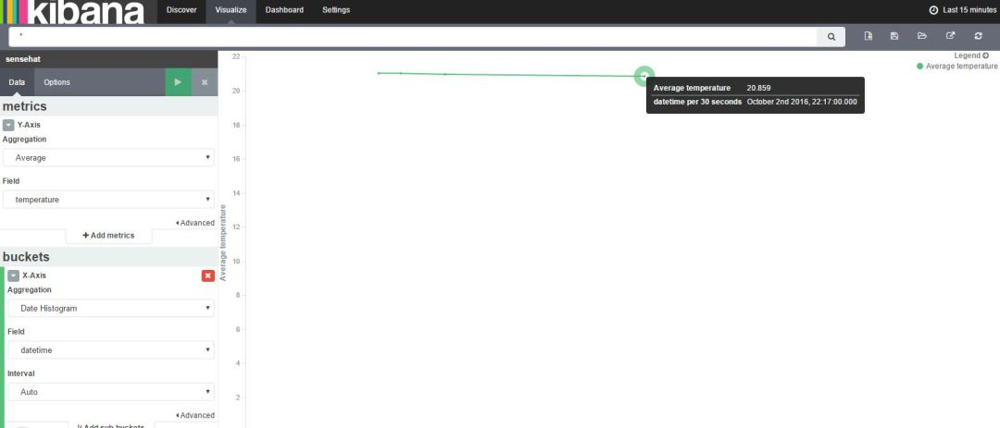

In the Previous post I just sent the data from my Sense Hat to AWS and saved it in Amazon DynamoDB. In this post I decided to show some graphs and chart on the dashboard using Kibana and Amazon ElasticSearch.

Kibana is basically an open source plug-in for elastic search which creates nice dashboard very simple and easy. Since I already have data sent to AWS IoT, one of the rules that I can leverage on is send it to ElasticSearch. Before creating the rule I need to have a domain in ElasticSearch so I can send data to index in it so I browse to my ElasticSearch console and create new domain (be careful when you want to choose a server, the free one is not default).

Since I already know the steps, I put a mapping in my domain and make a field for time stamp. The reason is that in kibana, we need a time field so we can show temperature based on that and the time that we send from sensor is not really acceptable type for kibana so I tag a time stamp in AWS IoT and in mapping I’d say what is the type is. For doing that I use Postman but also you can do it with this command:

Now I get back to IoT console and make a new rule like this:

After Creating a rule, it is time to send data from SenseHat. So I push the joy stick up for couple of times. Now when I check my domain’s index in ElasticSearch it looks like this

So I push couple of times more the joystick to have more data points, then I click on the Kibana link available on ElasticSearch console to configure my Kibana to have a line chart with my values as a time series.

First step is “Configure an index pattern”, so I write my Index name which is “sensehat” and it shows me my time-field name which is datetime (I did it in the first step with a PUT call in my domain).After creating my index, I go on discover page and choose my fields which are datetime and temperature. Now it is time to create my line chart, so I go to Visualize page and create a line chart from a new search. I choose Y axis average of temperature and X axis Date Histogram. Run and here it is

Hope you enjoy it and remeber that with kibana you can create a dashboard including different chart types and save it.
