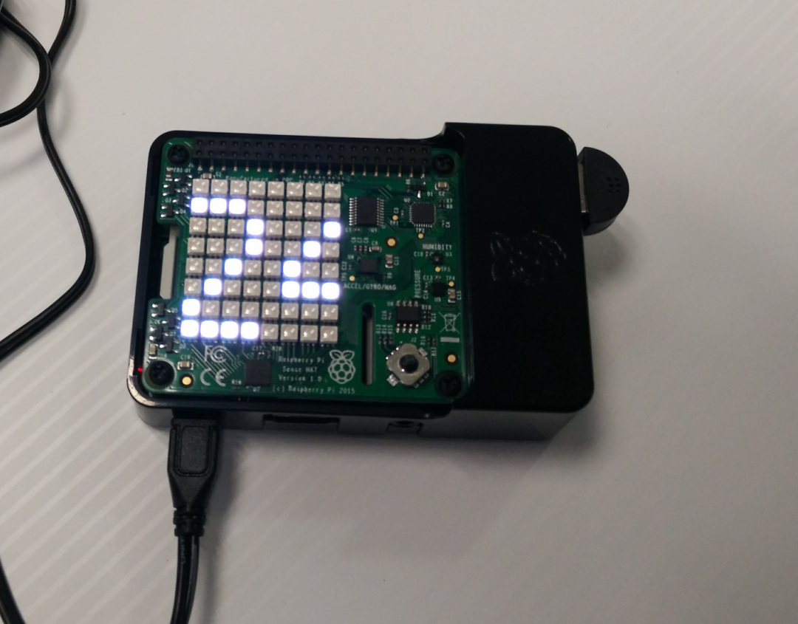
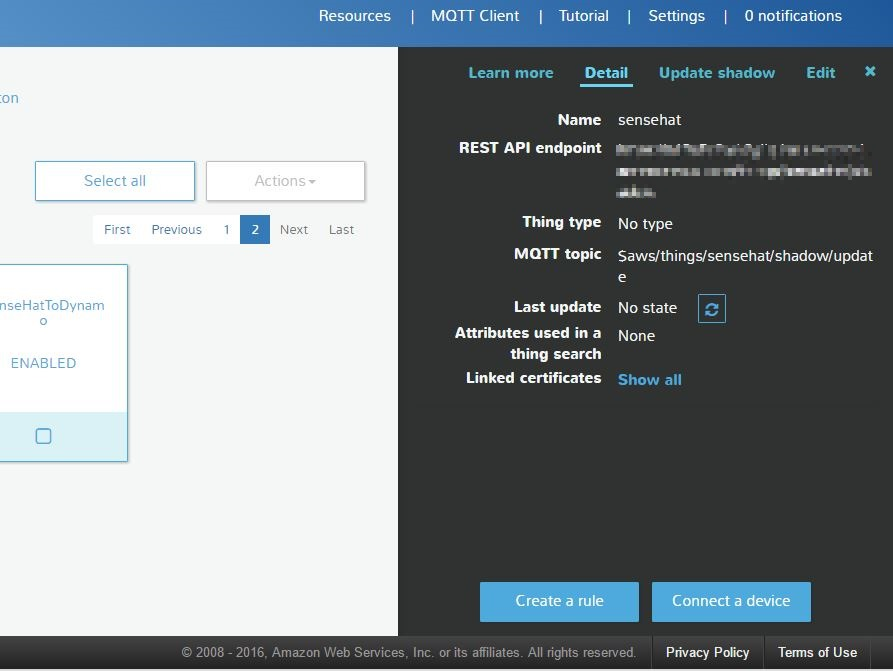
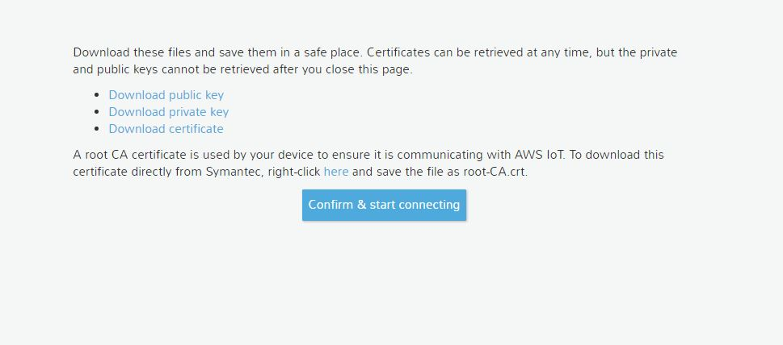
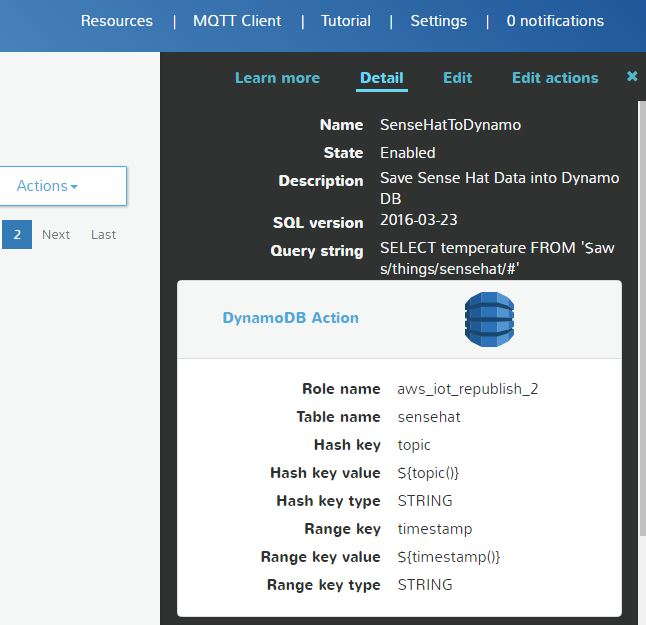
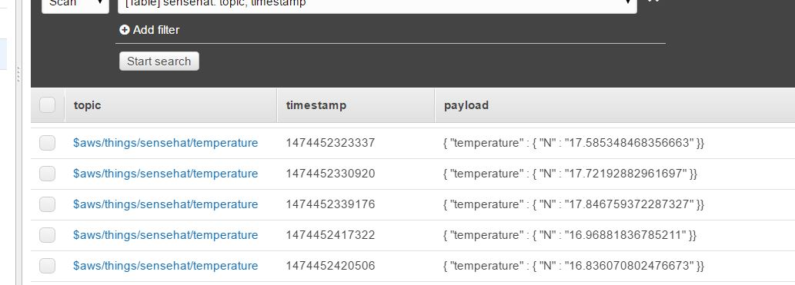

It’s been a while that I am using my AWS account to test the different web services and frankly I really like Amazon Web Services for its features and stability. I use my personal account and till now I haven’t paid anything since I was using Free Tier of all services. Actually, one time I got charged by Amazon for using ElasticSearch service because unintentionally I used medium server which was not free and after I found out I just deleted my domain in ElasticSearch and sent an email to support team explaining the situation, they just understood that my account is only for test so they removed my payment and I didn’t pay anything. This was very promising and I really appreciated that.

Anyway, one of the best IoT services between big companies is AWS IoT. I’m not going to explain the features and general abilities of AWS IoT, I just explain the example of sending sensors data of Sense Hat to AWS IoT. AWS has SDK for almost all common languages but since I’m using Python for playing with my Sense Hat, I’m gonna use Python SDK for connecting Sense Hat to AWS IoT.

In this demo I try to send data of temperature sensor to AWS IoT and save it on DynamoDB (no-SQL database service on Amazon). before start I should mention that you can find the complete code here: https://github.com/farminf/aws-sensehat

Fist of all for computing correct temperature I am using an algorithm which I found in some blogs and combine them I think this is the best result that I got since the temperature value that Sense Hat returns is so high due to the CPU temperature.

```python
temp_humidity = sense.get_temperature_from_humidity()
temp_pressure = sense.get_temperature_from_pressure()
temp_cpu = get_cpu_temp()
t = (t1+t2)/2
temp_correct = t - ((t_cpu-t)/1.5)
```

then I try to get average of last 3 values to make it more realistic:

```python
def get_average(x):
if not hasattr(get_average, "t"):
get_average.t = [x,x,x]
get_average.t[2] = get_average.t[1]
get_average.t[1] = get_average.t[0]
get_average.t[0] = x
x_average = (get_average.t[0]+get_average.t[1]+get_average.t[2])/3
return(x_average )
```

Also I like to measure the temperature every time I press the joystick up:

```python
while True:
for event in sense.stick.get_events():
if event.action == "pressed" and event.direction == "up" :
```

So now every time I press it up, I measure the temperature. Now I can add the part that sends the data to my AWS IoT but before that I need to go to my AWS console and configure IoT and DynamoDB.



### Configuring AWS IoT

1.  I create a device and name it sensehat



2.  I export the certificates and save them in the folder called “cert” (hit connect a device and follow the steps to get into this page)



3.  Downloaded AWS CERT and put it in the same folder
4.  I create a table in DynamoDB and name it “sensehat” with Hash key and Range key
5.  I create a rule and configure it as follow



As you can see, I configured it in the way that every time I receive an MQTT message which has been publish to “$aws/things/sensehat/#” (# means whatever) , save it in sensehat table in DynamoDB using topic of the message as a hash key and timestamp of the message as a range key so I can query later easier.

Now, I just run the python file on my Raspberry and every time I press the joystick up, it sends a value of temperature sensor to AWS and when I browse my table in DynamoDB I see this:



However if you want to monitor your temperature you can just code the Python file in the way that it sends data every interval of time but be careful cause Amazon probably charge you if you pass the Free Tier.
