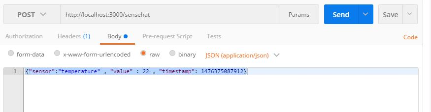

Having a Sense HAT with environmental sensors like temperature, humidity and pressure is nice and it is easy to read their values with a simple Python code. However, it would be nicer if we can bring all of them on the same page beside each other and have some historic data of them or even having other information related to Internet APIs like weather.So I decided to build a dashboard to show the sensors data of my Sense HAT plus putting some charts to see the data of last days.

First of all I needed an API for getting the data and saving it in a database and exposing it for my web application. In this way I could consume my data in whatever way that I like, I can use it in my web application or even build a mobile app or anything. Therefore, I chose nodejs and expressJS to build my HTTP Rest API application and MongoDB as a database since it is really easy, light and it’s non relational DB.

> _Note:complete project [sensehat API](https://github.com/farminf/sensehat-api) is on GitHub and you can clone it._

Before anything I need to install MongoDB, node and npm on my Raspberry then I can start the implementation part.

### MongoDB

```bash
sudo apt-get install mongodb-server
sudo service mongod start
```

### Node and npm

```bash
curl -sL https://deb.nodesource.com/setup_5.x | sudo bash –
apt-get install nodejs -y
```

### Mongoose and ExpressJS

Mongoose is basically a npm library to connect to Mongo for reading and writing data.

```bash
npm install mongoose
```

For implementing the HTTP restful API I use Express library

```bash
npm install express
```

Now that I have the tools I need I can start implementing my API app but before that I should decide my api architecture.On one hand I need to save the data that comes from Sesne HAT and on the other hand I need to expose the data to my Dashboard.

For saving the data, I can POST from Sense HAT with a python script every interval of time and for exposing data to my dashboard I can have one call for giving all sensor names, one for last value of each sensor (for current status) and one for last x number of values (I chose 300 because if I send every 2 minutes a value, then I can have last 10 hours) related to each sensor (for chart).

1.  POST /sensehat , for sending from Python script
2.  GET /sensehat , for getting all sensor names
3.  GET /sensehat/$sensor_name , getting last value of $sensor
4.  GET /sensehat/$sensor_name/historic , getting last 300 values of $sensor
5.  DELETE /sensehat/deleteall , to delete all data

I also decide my data string that I want to send from Sense HAT python script so I can make my responds. I try to be as simple as possible.

##### MY DATA STRING

```json
{
    ensor: “#name_of_sensor”,
    value: “value_of_sensor”,
    timestamp: “timestamp_in_millisecond_unix_format”
}
```

## Implementation

I’m not going to explain in details how to program in nodejs and just try to explain the important part. My project [sensehat API](https://github.com/farminf/sensehat-api) is on GitHub and you can clone it.

First of all, I define my database schema to accept just the format of my json string that I send.

```js
var mongoose = require(‘mongoose’);

var SensehatSchema = new mongoose.Schema({
sensor: String,
value: Number,
timestamp: Number
});

module.exports = mongoose.model(‘Sensehat’, SensehatSchema);
```

Then I implemen the part that it connects to my MongoDB inside `app.js` file

```js
var mongoose = require(‘mongoose’);

mongoose.Promise = global.Promise;

mongoose.connect(‘mongodb://localhost/sensehat-dashboard’)
.then(() => console.log(‘connection to mongo was succesful’))
.catch((err) => console.error(err));
```

Then I define my express library in app.js file and give the api root link and route file to implement my API routes.

```js
var express = require(‘express’);

var sensehat = require(‘./routes/sensehat’);
//this is path to my route file

var app = express();

app.use(‘/sensehat’, sensehat);
```

I create a file in the path /routes and name it sensehat.js and I implement my API POST and GET in this file.

```js
var express = require(‘express’);
var router = express.Router();

var SensehatMongo = require(‘../models/Sensehat.js’);
//This is where my mongo schema is

/* GET /sensehat listing. */
router.get(‘/’, function(req, res, next) {
SensehatMongo.find().distinct(‘sensor’, function(err, sensehat){
if (err) return next(err);
res.header(‘Access-Control-Allow-Headers’, ‘Content-Type’);
res.header(‘Access-Control-Allow-Headers’, ‘*’);
res.header(‘Access-Control-Allow-Origin’, ‘*’);
res.json(sensehat);
});
});

/* POST /sensehat */
router.post(‘/’, function(req, res, next) {
SensehatMongo.create(req.body, function (err, post) {
if (err) return next(err);
res.header(‘Access-Control-Allow-Headers’, ‘Content-Type’);
res.header(‘Access-Control-Allow-Headers’, ‘*’);
res.header(‘Access-Control-Allow-Origin’, ‘*’);
res.json(post);
});
});

/* GET /sensehat/sensor_name */
router.get(‘/:sensor’, function(req, res, next) {
SensehatMongo.findOne({
    “sensor” : req.params.sensor},
    {},
    { sort: { ‘timestamp’ : -1 } },
    function (err, post) {
        if (err) return next(err);
        res.header(‘Access-Control-Allow-Headers’, ‘Content-Type’);
        res.header(‘Access-Control-Allow-Headers’, ‘*’);
        res.header(‘Access-Control-Allow-Origin’, ‘*’);
        res.json(post);
    });
});

/* GET /sensehat/sensor_name/historic */
router.get(‘/:sensor/historic’, function(req, res, next) {
SensehatMongo.find
    ({
        “sensor” : req.params.sensor
    },
    {},
    { sort: { ‘timestamp’ : -1 } , limit : 300},
    function (err, post) {
        if (err) return next(err);
        res.header(‘Access-Control-Allow-Origin’, ‘*’);
        res.json(post);
    });
});
/* DELETE ALL /sensehat/deleteall */
router.delete(‘/deleteall’, function(req, res, next) {
SensehatMongo.remove({ }, function (err, post) {
if (err) return next(err);
res.json(post);
});
});

/* DELETE an Item /sensehat/:id */
router.delete(‘/:id’, function(req, res, next) {
SensehatMongo.findByIdAndRemove(
    req.params.id, req.body, function (err, post) {
if (err) return next(err);
res.json(post);
});
});

module.exports = router;
```

Now it is time to test our API, let’s go to root folder of the node project and do npm start.

I do my tests with Postman, chrome plugin which I really like but before POST anything if I browse to http://localhost:3000/sensehat it should respond with empty array since we did not have any record in Mongo.

let’s post a fake string to save in Mongo like `{“sensor”:”temperature” , “value” : 22 , “timestamp”: 1476375087912}`.



after getting successful respond, if I browse again to http://localhost:3000/sensehat, I should get an array including “temperature” and if I browse to to http://localhost:3000/sensehat/temperature, I should see my json string. If I post more data, it should just show me the last one and instead http://localhost:3000/sensehat/temperature/histroric will respond 300 json objects including all fields in an array.

you can also test the other API calls to make sure everything is working…

So now we have our API server app ready, I just need to make my Python script ready to post data to my API server and then I will build my dashboard consuming gathered data.

In next post, I do the Python Script part…
