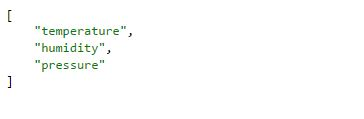
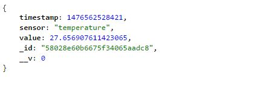
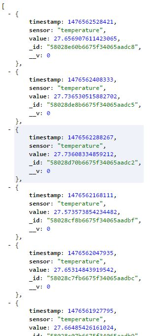

In the last post, I prepared my API part and make it ready for accepting my HTTP calls, so in this one I write a simple python script to read the values from Sense HAT and POST it to my API to save it in MongoDB.

I want to read temperature, humidity and pressure from Sense HAT and I want to read it every 2 minutes. I know this is a small interval of time for these kind of sensors but I do it just for fun 🙂

In one of my previous posts I did the temperature part to have the best value since `sense.get_temperature()` doesn’t really give a real temperature value. Then, I can read humidity and pressure easily:

```python
humidity = sense.get_humidity()

pressure = sense.get_pressure()
```

Afterward, I need to implement my POST part. as you see in my last post I design my API in the way that I need to POST "/sensehat" a string like `{sensor : "$name_of_sensor" , value: "$value" , timestamp:"$time_in_milliseconds_unix_format"}`:

```python
import urllib2

req = urllib2.Request("http://localhost:3000/sensehat")
req.add_header(‘Content-Type’, ‘application/json’)

response = urllib2.urlopen(req, json.dumps(result_json))
```

At the end my script would be something like this:

```python
At the end my script would be something like this:

import urllib2
import os
import time
from sense_hat import SenseHat
import json
from datetime import datetime

# get CPU temperature
def get_cpu_temp():
res = os.popen("vcgencmd measure_temp").readline()
t = float(res.replace("temp=","").replace("‘C\n",""))
return(t)

# use moving average to smooth readings
def get_smooth(x):
if not hasattr(get_smooth, "t"):
get_smooth.t = [x,x,x]
get_smooth.t[2] = get_smooth.t[1]
get_smooth.t[1] = get_smooth.t[0]
get_smooth.t[0] = x
xs = (get_smooth.t[0]+get_smooth.t[1]+get_smooth.t[2])/3
return(xs)

sense = SenseHat()
sense.clear()

while True:
req = urllib2.Request("http://localhost:3000/sensehat")
req.add_header(‘Content-Type’, ‘application/json’)
#Temperature
t1 = sense.get_temperature_from_humidity()
t2 = sense.get_temperature_from_pressure()
t_cpu = get_cpu_temp()
t = (t1+t2)/2
t_corr = t – ((t_cpu-t)/1.5)
t_corr = get_smooth(t_corr)
timestamp = int(time.time()*1000)
result_json_temperature = {
    "sensor":"temperature" ,
    "value" : t_corr ,
    "timestamp" : timestamp }
response = urllib2.urlopen(req, json.dumps(result_json_temperature))
print (response)

#Humidity
req = urllib2.Request("http://localhost:3000/sensehat")
req.add_header(‘Content-Type’, ‘application/json’)
humidity = sense.get_humidity()
timestamp = int(time.time()*1000)
result_json_humidity = {
    "sensor":"humidity",
    "value" : humidity ,
    "timestamp" : timestamp }
response = urllib2.urlopen(req, json.dumps(result_json_humidity))
print (response)

#Pressure
req = urllib2.Request("http://localhost:3000/sensehat")
req.add_header(‘Content-Type’, ‘application/json’)
pressure = sense.get_pressure()
timestamp = int(time.time()*1000)
result_json_pressure = {
    "sensor": "pressure" ,
    "value": pressure ,
    "timestamp": timestamp }
response = urllib2.urlopen(req, json.dumps(result_json_pressure))
print (response)

# Sleep for 2 minutes
time.sleep(120)
```

I started my API app, with "npm start" in a [Screenie](https://www.mankier.com/1/screenie) session and then I run my Python code in another Screenie session and leave them running…
After a day I see how’s my API working, so I browse to (GET) http://my_pi_address:3000/sensehat



then, http://my_pi_address:3000/sensehat/temperature



and http://my_pi_address:3000/sensehat/temperature/historic



which contains 300 objects.

That is great, it works like a charm but still it doesn’t look like a good dashboard.

In future I'd build a compelling dashboard using React 🙂
