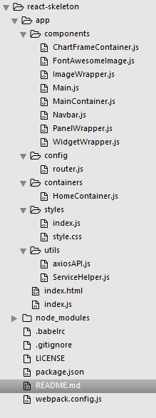
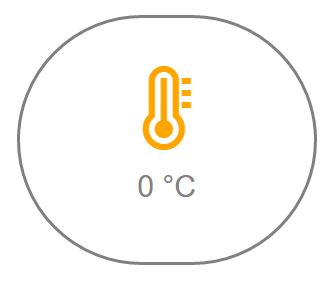
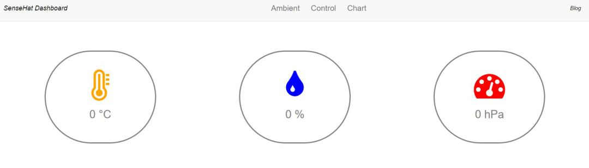
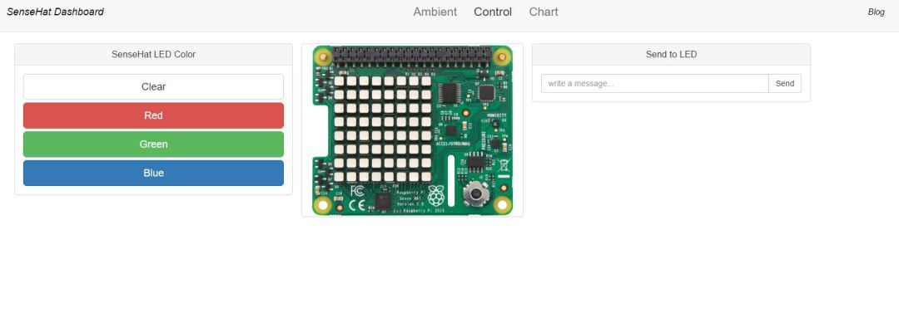

These days the comparison between React and Angular2 is a very hot topic. I’ve seen some people build the dashboards on top of both and compare the features and basically the do pros and cons. So, I decided to the same thing for my SenseHat and see the result.

I started to implement very light and easy API server using Python on my Raspberry just to respond the calls from dashboard. It doesn’t have any database or any historic data feature, It just gives the current value of Temperature, Humidity and pressure sensor of SenseHat and additionally it accept post for showing a text on SenseHat LED or make the LED colorful (Red, Green and Blue). I did the API part using flask , a python library which is awesome. For configuring and installing it and also getting familiar with flask, I found [this beautiful tutorial](https://blog.miguelgrinberg.com/post/designing-a-restful-api-with-python-and-flask) that explains everything and helped me a lot.

I just implemented one file and you can find it on my GitHub [HERE](https://github.com/farminf/sensehat-api-python)

As you can see I have implemented 3 functions to interact with my Dashboard (2 Gets and 1 Post).

```python
#!flask/bin/python
import os
from flask import Flask , jsonify , request
from sense_hat import SenseHat
from flask_cors import CORS, cross_origin


app = Flask(__name__)
CORS(app)

sense = SenseHat()
sense.clear()


# get CPU temperature
def get_cpu_temp():
  res = os.popen("vcgencmd measure_temp").readline()
  t = float(res.replace("temp=","").replace("'C\n",""))
  return(t)

@app.route('/api')
def index():
    return "try with '/ambient' "

@app.route('/api/ambient', methods=['GET', 'OPTIONS'])
def get_ambient_params():
    t1 = sense.get_temperature_from_humidity()
    t2 = sense.get_temperature_from_pressure()
    t_cpu = get_cpu_temp()
    t = (t1+t2)/2
    temperature = t - ((t_cpu-t)/1.5)

    humidity = sense.get_humidity()

    pressure = sense.get_pressure()

    return jsonify({
        'temperature': temperature ,
        'humidity': humidity ,
        'pressure': pressure})

@app.route('/api/led/<rgb>', methods=['GET'])
def set_led_color(rgb):
    if rgb == 'red':
        X = [255, 0, 0]  # Red
    elif rgb == 'green':
        X = [0, 255, 0]  # green
    elif rgb == 'blue':
        X = [0, 0, 255]  # blue
    color = [
        X, X, X, X, X, X, X, X,
        X, X, X, X, X, X, X, X,
        X, X, X, X, X, X, X, X,
        X, X, X, X, X, X, X, X,
        X, X, X, X, X, X, X, X,
        X, X, X, X, X, X, X, X,
        X, X, X, X, X, X, X, X,
        X, X, X, X, X, X, X, X
        ]
    sense.set_pixels(color)
    return jsonify({'success': True })

@app.route('/api/led', methods=['POST'])
def set_led_message():
    if not request.json or not 'message' in request.json:
        abort(400)
    sense.show_message(
        request.json["message"],
        text_colour=[255, 255, 255])
    return jsonify({'success': True })

@app.route('/api/led/clear', methods=['GET'])
def set_led_clear():
    sense.clear()
    return jsonify({'success': True })

@app.errorhandler(404)
def not_found(error):
    return jsonify({'error': 'Not found'})

if __name__ == '__main__':
    app.run(debug=True,host='0.0.0.0')
```

OK so everything is ready to build a nice Dashboard and show some sensor data, wirte some data on LED and also play a little bit with React. I prepared an Skeleton for my React project so in this way every time I want to build a new Dashboard I don’t need to repeat and waste time to create my skeleton. you can find my skeleton app on my Github account –> [HERE](https://github.com/farminf/react-skeleton)

So basically, after cloning, you just need to do ‘npm install’ and after downloading all modules, for running it, ‘npm start’. After starting, you should be able to see an empty page (simple navigation and empty container) on http://localhost:8080.

I’ve put some components in the skeleton which later you see why I am using them and basically I can use this skeleton project anytime I want to build a dashboard. Briefly, I explain what skeleton project has:

1.  npm package file including all dependencies and scripts
2.  Webpack configuration file
3.  Router configuration in config folder which in any dashboard is extendable
4.  A service file using Axios for consuming Restful services in uitls folder
5.  Containers folder including the main views
6.  Components folder for all components (now there are some default wrappers and view containers)



So what do I want for my Dashboard? First thing I want a page just to show the current value of temperature, Humidity and Pressure. Then I want a page for showing them on the graph but not the historical one, I want real-time Dashboard. More, I want a page to play with the LED, so some buttons to change the color of LED and a form like element to send my string and show it on LED.

So before starting let’s see how I can design the architecture of all components. The good thing about React is, we just need to write our components (widgets in our case) and then use them in one view or even use them in multiple view. Also, it is OK to copy them from one dashboard to other. In case of the update on any of this widgets, React will update only that widget and nothing. Note: there is this weird combination of the XML syntax and JS in one file which after working with react it’ll get normal, believe me 🙂

before going to visualization part, let’s furnish our little service part which is the part we call the API. I prepare this with some functions and then inside each component I just import it and use the function that we need to call.
(I renamed the helper.js to SensehatHelper.js)

```js
var axiosAPI = require('./axiosAPI')

var helpers = {
  getAmbientValues: function() {
    return axiosAPI.get('/ambient').catch(function(err) {
      console.warn('Error in getAmbientValues: ', err)
    })
  },
  setLEDRGB: function(color) {
    return axiosAPI.get('/led/' + color).catch(function(err) {
      console.warn('Error in setLEDRGB: ', err)
    })
  },
  setLEDMessage: function(message) {
    return axiosAPI
      .post('/led', {
        message: message,
      })
      .catch(function(err) {
        console.warn('Error in setLEDRGB: ', err)
      })
  },
}

module.exports = helpers
```

Ok, so I start implementing my router and then my navigation. In this way I always have my navigation on top and React is just updating the containers (views). I need 3 views, one for monitoring ( calling Ambient), one for controlling(Control) and one for charts (Chart). So I need to have something like this:

```js
var routes = (
  <Router history={hashHistory}>
    <Route path="/" component={Main}>
      <IndexRoute component={AmbientContainer} />
      <Route path="ambient" header="Ambient" component={AmbientContainer} />
      <Route path="control" header="Control" component={ControlContainer} />
      <Route path="chart" header="Chart" component={ChartContainer} />
    </Route>
  </Router>
)
```

Then for navigation I need to modify the navbar file which is already inside component folder.(this component is included in main.js because it should not be reloaded based on the routes):

```js
var React = require('react')
var ReactRouter = require('react-router')
var textcolorblack = require('../styles').textcolorblack
var bloglink = require('../styles').bloglink
var Link = ReactRouter.Link

function Navbar() {
  return (
    <nav className="navbar navbar-default">
      <div className="container-fluid">
        <div className="navbar-header">
          <button
            type="button"
            className="navbar-toggle collapsed"
            data-toggle="collapse"
            data-target="#bs-example-navbar-collapse-1"
            aria-expanded="false"
          >
            <span className="sr-only">Toggle navigation</span>
            <span className="icon-bar" />
            <span className="icon-bar" />
            <span className="icon-bar" />
          </button>
          <p className="navbar-brand" style={textcolorblack}>
            SenseHat Dashboard
          </p>
        </div>
        <div
          id="bs-example-navbar-collapse-1"
          className="collapse navbar-collapse"
        >
          <ul className="nav navbar-nav">
            <li>
              <Link to="/">
                Ambient<span className="sr-only">(current)</span>
              </Link>
            </li>
            <li>
              <Link to="/control">Control</Link>
            </li>
            <li>
              <Link to="/chart">Chart</Link>
            </li>
          </ul>
          <ul className="nav navbar-nav navbar-right">
            <li>
              <a
                style={bloglink}
                target="_blank"
                href="https://iotdemos.wordpress.com"
              >
                Blog
              </a>
            </li>
          </ul>
        </div>
      </div>
    </nav>
  )
}
module.exports = Navbar
```

Then I should create the containers related to my routes in the Containers folder. So I create AmbientContainer.js, ChartContainer.js and ControlContainer.js and also import it in my router.js:

```js
var AmbientContainer = require('../containers/AmbientContainer')
var ControlContainer = require('../containers/ControlContainer')
var ChartContainer = require('../containers/ChartContainer')
```

So inside each container I can include my component or components to show on each view. so for example I’ll add a component called “Ambient” inside my AmbientContainer and I’ll pass the the props related to each sensor to Ambient component (I get the value using a function in our helper, I do it in componentDidMount since it makes sure that the component is already rendered and then it updates the view ):

```js
var React = require('react')
var Ambient = require('../components/Ambient')
var SensehatHelper = require('../utils/SensehatHelper')

var AmbientContainer = React.createClass({
  getInitialState: function() {
    return {
      isLoading: true,
      temperature: 0,
      humidity: 0,
      pressure: 0,
    }
  },
  componentDidMount: function() {
    SensehatHelper.getAmbientValues().then(
      function(result) {
        this.setState({
          isLoading: false,
          temperature: result.data.temperature,
          humidity: result.data.humidity,
          pressure: result.data.pressure,
        })
      }.bind(this)
    )
  },
  render: function() {
    return (
      <Ambient
        isLoading={this.state.isLoading}
        temperature={this.state.temperature}
        humidity={this.state.humidity}
        pressure={this.state.pressure}
      />
    )
  },
})

module.exports = AmbientContainer
```

Then we make a file called “Ambient” inside the component folder and we receive the props that AmbientContainer sent to that. In Addition we pass these props to our sub modules which we want to create later show the visual value of sensor(We call them Monitor Widget

```js
var React = require('react')
var MonitorWidget = require('./MonitorWidget')
var Widgetwrapper = require('./Widgetwrapper')
var MainContainer = require('./MainContainer')

function Ambient(props) {
  return (
    <MainContainer>
      <Widgetwrapper>
        <MonitorWidget
          panel_tile="Temperature"
          panel_content={props.temperature}
          panel_icon="thermometer"
          unit="°C"
        />
      </Widgetwrapper>
      <Widgetwrapper>
        <MonitorWidget
          panel_tile="Humidity"
          panel_content={props.humidity}
          panel_icon="tint"
          unit="%"
        />
      </Widgetwrapper>
      <Widgetwrapper>
        <MonitorWidget
          panel_tile="Pressure"
          panel_content={props.pressure}
          panel_icon="tachometer"
          unit="hPa"
        />
      </Widgetwrapper>
    </MainContainer>
  )
}

module.exports = Ambient
```

You can see that there are also two other tags, MainContainer and Widgetwrapper. these two are already in skeleton project since we use them in all part of the dashboard. Basically these two are the bootstrap frames or container for our widget or any element we want to visualize. for example the Widgetwrapper is simple bootstrap div with exact size. like this:

```js
var React = require('react')
var PropTypes = React.PropTypes

function WidgetWrapper(props) {
  return <div className="col-sm-4 ">{props.children}</div>
}
module.exports = WidgetWrapper
```

Also, you can see that I have put three props in each MonitorWidget tag: name of the sensor, value which we get from container, unit of the value and also dedicated icon. I use the icon to make my dashboard a little bit nicer, so I like the "Font Awesome" library and I have used it before in Angular1 and also JS plain projects and now I’ll use it also in my React project.(the name of the icon is in their website) I have already put the dependency for Font Awesome in out package.json.
Next we gonna create out MonitorWidget file in the components and implement our widget using props. Remember to import Font Awesome to use it. Also, I have already put my CSS in the skeleton, in that I have provide a class for circle and other things that I use for visualization part.

```js
var React = require('react')
var transparentBg = require('../styles').transparentBg
var FontAwesome = require('react-fontawesome')

function MonitorWidget(props) {
  var inverse = true
  return (
    <div className="jumbotron col-sm-12 text-center" style={transparentBg}>
      <div className="circle">
        <p>
          <FontAwesome name={props.panel_icon} size="4x" />
          <h2>
            {props.panel_content} {props.unit}
          </h2>
        </p>
      </div>
    </div>
  )
}

module.exports = MonitorWidget
```

So my widget would be something like this:



and I have used same component for other 2 sensors and as you have already seen, I just passed different props to same component. so my Ambient page would be like this:



I do the same procedure for control, so I make a ControlContainer, and then inside that Control component and then I implement my widgets and include it in the control view. For coloring the LED, let’s put 4 buttons: Red, blue, green and one for clearing the LED and using API server, everytime we click on the button, we call the specific API depends on the button using the helper file.

```js
var React = require('react')
var SensehatHelper = require('../utils/SensehatHelper')

function SwitchOnOff(props) {
  handleClick = function() {
    console.log(props.button_label)
    SensehatHelper.setLEDRGB(props.button_label.toLowerCase())
  }
  return (
    <button
      type="button"
      className={props.button_type}
      onClick={this.handleClick}
    >
      {props.button_label}
    </button>
  )
}
module.exports = SwitchOnOff
```

Cool! I also build a component for sending a string to API, for showing on Sensehat LED and name this module InputWidget.

```js
var React = require('react')
var styles = require('../styles')
var SensehatHelper = require('../utils/SensehatHelper')

function InputWidget(props) {
  this.state = {
    inputValue: '',
  }
  updateInputValue = function(evt) {
    this.state.inputValue = evt.target.value
  }
  handleClick = function() {
    console.log(this.state.inputValue)
    SensehatHelper.setLEDMessage(this.state.inputValue)
  }
  return (
    <div className="input-group">
      <input
        type="text"
        className="form-control"
        placeholder={props.placeholder}
        onChange={this.updateInputValue}
      />
      <span className="input-group-btn">
        <button
          className="btn btn-default"
          type="submit"
          onClick={this.handleClick}
        >
          {props.button_name}
        </button>
      </span>
    </div>
  )
}
module.exports = InputWidget
```

Now I can build up my control view using these components:
(four button components with different props, one pure img tag and one Input Widget

```js
var React = require('react')
var transparentBg = require('../styles').transparentBg
var MainContainer = require('./MainContainer')
var PanelWrapper = require('./PanelWrapper')
var ImageWrapper = require('./ImageWrapper')
var SwitchOnOff = require('./SwitchOnOff')
var sensehatImage = require('../images/sensehat2.png')
var InputWidget = require('./InputWidget')

var Control = React.createClass({
  render: function() {
    return (
      <MainContainer>
        <PanelWrapper header="SenseHat LED Color">
          <SwitchOnOff
            button_label="Clear"
            button_type="btn btn-lg btn-default btn-block"
          />
          <SwitchOnOff
            button_label="Red"
            button_type="btn btn-lg btn-danger btn-block"
          />
          <SwitchOnOff
            button_label="Green"
            button_type="btn btn-lg btn-success btn-block"
          />
          <SwitchOnOff
            button_label="Blue"
            button_type="btn btn-lg btn-primary btn-block"
          />
        </PanelWrapper>
        <ImageWrapper>
          
        </ImageWrapper>
        <PanelWrapper header="Send to LED">
          <InputWidget placeholder="write a message..." button_name="Send" />
        </PanelWrapper>
      </MainContainer>
    )
  },
})
module.exports = Control
```

My final control page would be something like this:



I arrive at the difficult point… live chart
I like D3 Library because it is very clean and very simple to use so I use D3 chart to make my chart view. I make a component and name it D3chartWidget. In this one I should update the chart every second so I need to call the API every second and add the value to an array which I show it on the chart:

```js
var React = require('react')
var LineChart = require('react-d3-basic').LineChart
var core = require('react-d3-core')
var SensehatHelper = require('../utils/SensehatHelper')

var D3chartWidget = React.createClass({
  updateChart: function() {
    SensehatHelper.getAmbientValues().then(
      function(result) {
        if (this.props.sensor == 'temperature') {
          this.setState({
            chartData: this.state.chartData.concat([
              {
                sensor: result.data.temperature,
                date: new Date(),
              },
            ]),
          })
        } else if (this.props.sensor == 'humidity') {
          this.setState({
            chartData: this.state.chartData.concat([
              {
                sensor: result.data.humidity,
                date: new Date(),
              },
            ]),
          })
        } else {
          this.setState({
            chartData: this.state.chartData.concat([
              { sensor: result.data.pressure, date: new Date() },
            ]),
          })
        }
      }.bind(this)
    )
  },
  getRandomInt: function(min, max) {
    return Math.floor(Math.random() * (max - min + 1)) + min
  },
  getInitialState: function() {
    return {
      chartData: [],
    }
  },
  componentDidMount: function() {
    this.intervalId = setInterval(() => this.updateChart(), 1000)
    this.setState({ intervalId: this.intervalId })
  },
  componentWillUnmount: function() {
    clearInterval(this.state.intervalId)
  },
  render: function() {
    var width = 600
    var height = 300
    var margins = { left: 50, right: 20, top: 20, bottom: 60 }
    var title = 'Title'
    var parseDate = d3.time.format('%YM%m').parse
    xDomain = d3.extent(this.state.chartData, function(d) {
      return x(d)
    })
    xRange = [0, width - margins.left - margins.right]
    ;(xScale = 'time'), (xLabel = 'Time')

    // chart series,
    // field: is what field your data want to be selected
    // name: the name of the field that display in legend
    // color: what color is the line
    chartSeries = [
      {
        field: 'sensor',
        name: this.props.sensor,
        color: this.props.color,
      },
    ]
    // your x accessor
    x = function(d) {
      return d.date
    }

    return (
      <LineChart
        margins={margins}
        title={title}
        data={this.state.chartData}
        width={width}
        height={height}
        chartSeries={chartSeries}
        x={x}
        xScale={xScale}
        xLabel={xLabel}
        xDomain={xDomain}
        xRange={xRange}
        showXGrid={true}
        showYGrid={false}
      />
    )
  },
})
module.exports = D3chartWidget
```

Then I will use this component in my container. The nice thing about React in this component is that I just can add a whole chart by adding just one line to the other view and maybe later I use it in another dashboard.

You can find the whole project [HERE](https://github.com/farminf/sensehat-react) in my GitHub page and feel free to contribute or if there is a bug please let me know.
